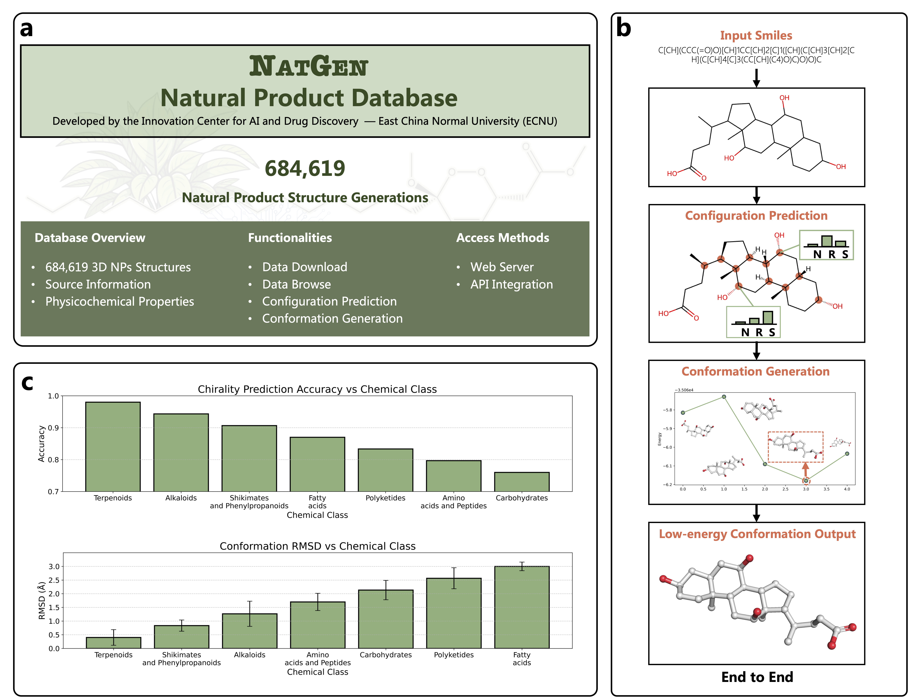

# Accurate Structure Prediction of Natural Products with NatGen
This repository contains the code for *Accurate Structure Prediction of Natural Products with NatGen*, which combines molecular conformation generation and chirality prediction for comprehensive structure analysis of natural products.

## MixUp Algorithm

NatGen employs advanced MixUp techniques specifically designed for molecular graph learning to enhance model performance and generalization capability.


*Visualization of inter-graph mixup and intra-graph mixup. Node features are color-coded, and positions reflect atomic coordinates. Edge feature mixing is omitted for clarity.*

### Inter-MixUp
Inter-MixUp performs feature mixing between different molecules by creating virtual training examples through linear interpolation of molecular features from different samples. This technique helps the model:
- **Improve generalization** by exposing the model to intermediate molecular structures
- **Enhance robustness** against variations in natural product structures
- **Reduce overfitting** by expanding the effective training data space
- **Better handle structural diversity** commonly found in natural products

### Intra-MixUp  
Intra-MixUp operates within individual molecules using line graph transformations, where edges become nodes and edge relationships become new edges. This approach enables:
- **Capture higher-order molecular interactions** beyond traditional atom-bond relationships
- **Model complex stereochemical relationships** crucial for chirality prediction
- **Enhance local structural understanding** for accurate conformation generation
- **Improve sensitivity to subtle structural differences** that determine chirality

### Benefits
The combination of Inter and Intra-MixUp provides significant advantages for natural product analysis:
- **Chirality Prediction**: Enhanced ability to distinguish between R/S configurations through improved local structure modeling
- **Conformation Generation**: More accurate 3D structure prediction by better understanding molecular flexibility and constraints
- **Structural Diversity Handling**: Robust performance across the wide chemical space of natural products
- **Data Efficiency**: Effective learning even with limited natural product training data

### Interpretability Analysis
Through gradient-based interpretability analysis, we found that NatGen's predictions for chirality are highly consistent with chemical expert knowledge, where the chiral atomic environment significantly influences the prediction values for chiral atoms.


*Interpretability of NatGen model. a, The chirality prediction comparison of the NatGen model trained on normal data and random data. b, Gradient-based analysis and importance ranking of chirality prediction for polychiral NPs. c, High-frequency substructures with identical chirality.*

## NatGen's Performance


*Demonstration of NatGen's conformation generation capability. Left: Predicted conformations (green) superimposed on crystal structures (gray), with RMSD values indicating prediction accuracy. Bemis-Murcko scaffolds are highlighted to illustrate scaffold diversity. Right: Pairwise structural similarity heatmap based on Morgan fingerprints and Dice coefficient.*

## Requirements and Installation

### Through Docker

We recommend building a Docker image with the [Dockerfile](Dockerfile).

After building and starting the docker, you can run

```shell
cd /workspace
git clone https://github.com/Neo-Flash/NatGen
cd NatGen
pip install -e .
```

You may possibly need to run `pip install setuptools==59.5.0` if you met problems with the `setuptools` module.

### Through conda venv
If you want to develop it locally using conda venv, please refer to Line 27 to Line 36 in [Dockerfile](Dockerfile) to build a virtual conda environment.

## Dataset

### Conformation Generation Dataset
Due to our utilization of the CSD (Cambridge Structural Database) crystal dataset, we cannot provide the complete dataset due to copyright restrictions. However, we provide the GEOM-QM9 and GEOM-Drugs dataset for your training and testing purposes.

### Small-scale GEOM-QM9 and GEOM-Drugs data
Download the **qm9_processed.7z** and **drugs_processed.7z** from this [url](https://drive.google.com/drive/folders/10dWaj5lyMY0VY4Zl0zDPCa69cuQUGb-6)

### Large-scale GEOM-QM9 and GEOM-Drugs data
Download **rdkit_folder.tar.gz** from this [url](https://dataverse.harvard.edu/dataset.xhtml?persistentId=doi:10.7910/DVN/JNGTDF) and untar this file by `tar -xvf rdkit_folder.tar.gz`

### Chirality Prediction Dataset
We use natural products from the Coconut dataset for training and inference. Please visit the official Coconut website to download: https://coconut.naturalproducts.net/


## Training and inference


*Architectural details and overall performance of NatGen. a, NatGen architecture for training. The processing modules are represented by rectangles. The arrows show the data flow. Black, input data; green, intra-graph mixup; blue, inter-graph mixup. The colored balls and sticks represent molecular graphs. N, no chiral; R, R-configuration; S, S-configuration. Lchiral, chiral loss; Lconf, conformation loss. b, The intra-graph mixup (left panel) and inter-graph mixup (right panel) modules. Input and output: molecular graph representations. E, set of bonds; V, set of atoms; R, atomic coordinates; U, global feature. c, The distribution of node-level representation without and with graph mixup in modules of conformation generation (upper panel) and chirality prediction (lower panel). Z, atomic number. d, Overall performance of NatGen on the COCONUT test set. The upper panel shows chirality prediction accuracy vs the number of chiral centers, while the lower panel displays 3D conformation generation coverage vs the number of chiral centers.*

To perform training and inference for both conformation generation and chirality prediction models, run the following scripts:

- **eval_chiral.py** - Evaluation for chirality prediction model
- **eval_conf.py** - Evaluation for conformation generation model  
- **train_chiral.py** - Training for chirality prediction model
- **train_conf.py** - Training for conformation generation model

Example usage:
```shell
# Train chirality prediction model
python train_chiral.py 

# Evaluate chirality prediction
python eval_chiral.py 

# Train conformation generation model
python train_conf.py 

# Evaluate conformation generation
python eval_conf.py 
```

## Checkpoints
We have provided the pretrained checkpoints on [GoogleDrive](https://drive.google.com/drive/folders/15DM2g4yt2KnkjNDsQmLVKIJQH0iHZhAa?usp=drive_link/)

## NatGen NPs database (NatGen-DB)



*NatGen NPs database (NatGen-DB). a, NatGen-DB detailed information. NPs molecules can be queried and relevant datasets can be downloaded. b, NPs structure prediction process. Users can input SMILES strings of NPs to predict their absolute configurations and 3D conformations in an end-to-end manner. c, Performance of NatGen across different categories of NPs in NatGen-DB. Upper panel: configuration prediction accuracy; Lower panel: conformation generation RMSD.*

Visit NatGen-DB at: https://www.lilab-ecust.cn/natgen

## Citation

Our work has been submitted to ChemRxiv and is currently under review at a peer-reviewed journal. Please cite our work as follows:

```
Xu J, Hu Q, Sun C, Zhang S, Li X, Ding X, et al. Accurate Structure Prediction of Natural Products with NatGen. ChemRxiv. 2025; doi:10.26434/chemrxiv-2025-1v9j8

This content is a preprint and has not been peer-reviewed.
```
